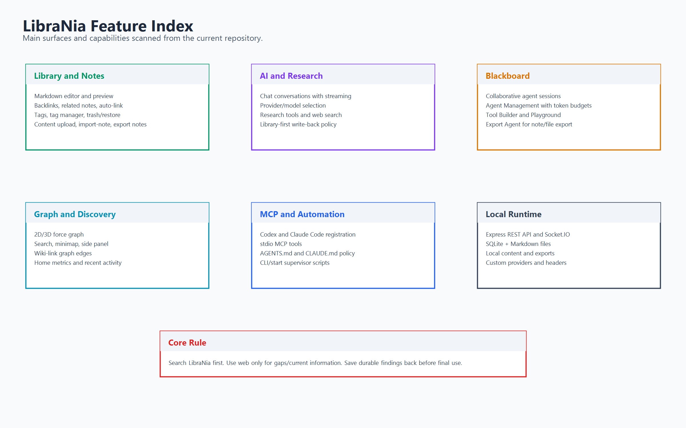
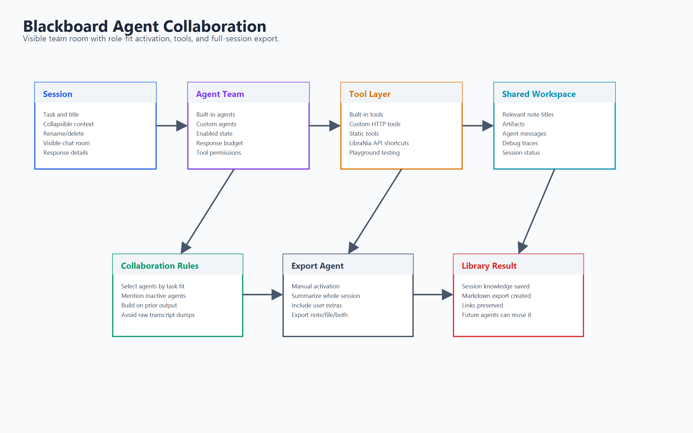
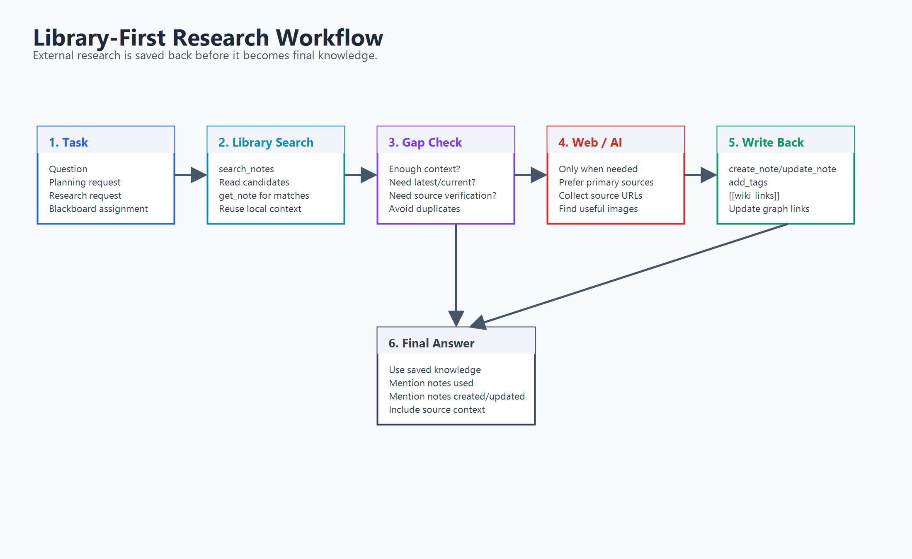
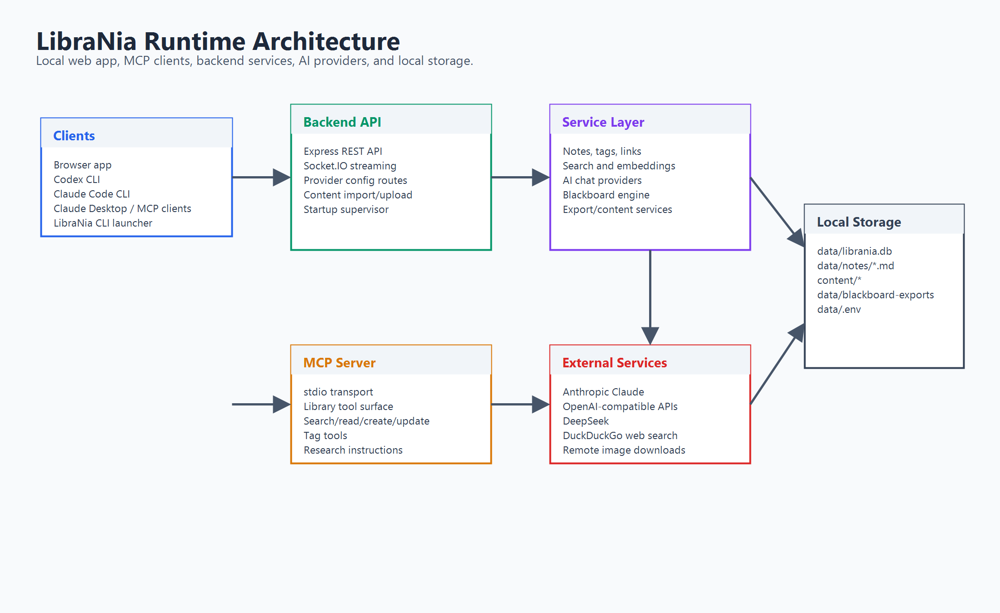

# LibraNia Comprehensive Guide

LibraNia is a local-first AI knowledge workspace. It combines a Markdown library, graph navigation, AI chat, a collaborative Blackboard agent room, custom tools, and MCP access for Codex and Claude Code.



## 1. Product Surfaces

### Home

The Home route is a dashboard for workspace state.

- Note count
- Graph connection count
- Tag count
- Research thread count
- Recent notes
- Recent conversations
- Graph health
- Tag vocabulary
- User-configurable widgets stored in local storage

### Library

The Library is the primary note workspace.

Capabilities:

- Browse notes in a left sidebar
- Create notes from the note list
- Edit Markdown notes
- Read rendered Markdown
- Attach tags to selected notes
- Manage all tags
- Upload content to the selected note
- List and delete attached content
- Import readable files as notes
- Export selected notes or the library
- Open QuickNav with keyboard navigation
- Open the right context panel for backlinks, related notes, and Librarian Ask

Note operations implemented by backend routes:

- `GET /api/notes`
- `POST /api/notes`
- `GET /api/notes/:id`
- `PUT /api/notes/:id`
- `DELETE /api/notes/:id`
- `GET /api/notes/deleted`
- `POST /api/notes/:id/restore`
- `GET /api/notes/:id/backlinks`
- `GET /api/notes/:id/related`
- `POST /api/notes/:id/auto-link`

Content operations:

- `POST /api/content/upload`
- `POST /api/content/import-note`
- `GET /api/content`
- `GET /api/content/:id`
- `DELETE /api/content/:id`

### Chat

Chat is a conversation workspace for provider-backed AI.

Capabilities:

- Create conversations
- Rename conversations
- Delete conversations
- Read message history
- Send chat messages
- Select provider/model
- Enable research mode
- Stream responses with Socket.IO
- Use library context when Research Mode is active

Conversation/API routes:

- `GET /api/conversations`
- `POST /api/conversations`
- `GET /api/conversations/:id`
- `PATCH /api/conversations/:id`
- `DELETE /api/conversations/:id`
- `GET /api/conversations/:id/messages`
- `POST /api/chat`
- `POST /api/library/ask`

### Graph

Graph visualizes the note network.

Capabilities:

- Force-directed graph visualization
- Graph node search
- Neighbor highlighting
- Side panel for note details
- Minimap
- Navigation from graph back to library context

Graph APIs:

- `GET /api/graph`
- graph node and edge route support through `src/api/graph.ts`

### Blackboard

Blackboard is the collaborative multi-agent room.



Capabilities:

- Assign a task to selected agents
- Create sessions
- Rename/delete sessions
- Collapse session/task context
- Read visible agent turns
- Inspect agent response details
- Send user messages into an existing session
- Mention agents with `@Name`
- Activate inactive agents by mention
- Store artifacts and session status
- Use tools inside agent turns
- Export a complete session through Export Agent

Blackboard APIs:

- `GET /api/blackboard/agents`
- `POST /api/blackboard/agents`
- `PUT /api/blackboard/agents/:id`
- `DELETE /api/blackboard/agents/:id`
- `GET /api/blackboard/tools`
- `POST /api/blackboard/tools`
- `PUT /api/blackboard/tools/:id`
- `DELETE /api/blackboard/tools/:id`
- `POST /api/blackboard/tools/:id/execute`
- `GET /api/blackboard/sessions`
- `GET /api/blackboard/sessions/:id`
- `PATCH /api/blackboard/sessions/:id`
- `DELETE /api/blackboard/sessions/:id`
- `POST /api/blackboard/sessions/:id/messages`
- `POST /api/blackboard/assign`

Default built-in agents:

- LibraNia Librarian
- Research Agent
- Reviewer
- Link Curator
- Architecture Planner
- Ideal Agent
- Export Agent

Built-in research/Blackboard tools:

- `search_notes`
- `get_note`
- `get_backlinks`
- `get_note_tags`
- `web_search`
- `create_note`
- `add_tags`
- `export_blackboard`

Custom tool types:

- `static`: deterministic template response with `{{field}}` placeholders
- `http`: HTTP request with method, relative or absolute URL, headers, body template, timeout

### Settings

Settings manages runtime and AI configuration.

Capabilities:

- Built-in provider keys
- Provider key deletion
- Model selection
- Custom provider base URL
- Multiple API keys
- Multiple custom headers
- Server/mode configuration

Provider APIs:

- `GET /api/providers`
- `GET /api/providers/:id`
- `POST /api/providers`
- `DELETE /api/providers/:id`

## 2. Research Workflow



Research policy:

1. Search LibraNia first.
2. Read relevant notes.
3. Use web search only when local knowledge is insufficient, stale, or the task asks for latest/current information.
4. Save useful web findings before treating them as durable knowledge.
5. Add tags.
6. Add `[[Exact Note Title]]` links.
7. Answer with the notes used, created, or updated.

This policy is represented in:

- `AGENTS.md`
- `CLAUDE.md`
- `backend/prompts/research.system.ts`
- `backend/tools/research.tools.ts`
- `mcp-server/src/index.ts`

## 3. Runtime Architecture



Main runtime components:

- React 19 frontend
- Vite build pipeline
- Express API backend
- Socket.IO streaming
- SQLite database through `better-sqlite3`
- Drizzle schema definitions
- AI provider adapters
- DuckDuckGo web search service
- Content extraction and remote image import
- Blackboard service
- MCP stdio server

## 4. Data Model

Core tables from `backend/database/schema.ts`:

- `notes`
- `tags`
- `note_tags`
- `links`
- `note_versions`
- `conversations`
- `messages`
- `citations`
- `content`
- `content_tags`
- `embeddings`

Local files:

- `data/librania.db`
- `data/notes/*.md`
- `content/*`
- `data/blackboard-exports/*`
- `data/.env`

## 5. MCP Server

The MCP server lives in `mcp-server/` and uses stdio.

Available MCP tools:

- `search_notes`
- `get_note`
- `create_note`
- `update_note`
- `add_tags`
- `list_tags`

Setup:

```bash
cd mcp-server
npm install
npm run build
npm run setup-codex
npm run setup-cli
```

Verify:

```bash
codex mcp get librania
claude mcp get librania
```

MCP data selection priority:

1. `LIBRANIA_DB_PATH`
2. `LIBRANIA_DATA_DIR/librania.db`
3. `./data/librania.db`

## 6. AI Providers

Supported provider architecture:

- Anthropic Claude through `@anthropic-ai/sdk`
- OpenAI-compatible APIs through `openai`
- DeepSeek through OpenAI-compatible base URL
- Custom providers with API keys, base URL, model, and headers

Provider keys are stored locally and should not be committed.

## 7. Search and Discovery

Search APIs:

- `POST /api/search`
- `POST /api/search/semantic`

Search modes:

- `fullText`
- `quickNav`
- `fuzzy`
- semantic endpoint placeholder for embedding-backed search

Embedding table support exists in the schema with 384 dimensions for `all-MiniLM-L6-v2`.

## 8. Export

Library export:

- `POST /api/export/notes`
- `POST /api/export/library`
- formats: `json`, `markdown`

Blackboard export:

- through `export_blackboard`
- targets: `library_note`, `markdown_file`, `both`
- output folder: `data/blackboard-exports/`

## 9. Startup and Build

Install:

```bash
npm install
cd mcp-server
npm install
cd ..
```

Build:

```bash
npm run build:package
cd mcp-server
npm run build
cd ..
```

Start:

```bash
npm start
```

Windows:

```bash
start.bat
```

CLI:

```bash
librania start
```

## 10. Project Layout

```text
backend/api/          REST routes
backend/services/     notes, graph, AI, search, content, Blackboard
backend/tools/        research tool definitions and execution
backend/database/     Drizzle schema and SQLite connection
backend/websocket/    Socket.IO handlers
src/routes/           Home, Library, Chat, Blackboard, Settings
src/components/       UI, notes, graph, chat, content, settings
src/api/              browser API clients
src/hooks/            UI data hooks
mcp-server/           MCP stdio server and setup scripts
scripts/              startup/build/sync helpers
docs/images/          documentation diagrams
```

## 11. Privacy and Git Hygiene

Ignored local data:

- `.env`
- `config.json`
- `.claude/`
- `.codex/`
- `data/`
- `content/`
- `archive/`
- `test-logs/`
- `test-storage/`

The repository is meant to track application code and docs, not personal library content.

## 12. Verification

This repo currently uses build verification:

```bash
npm run build:package
cd mcp-server
npm run build
```

The old tracked Vitest suite has been removed from the repository.
