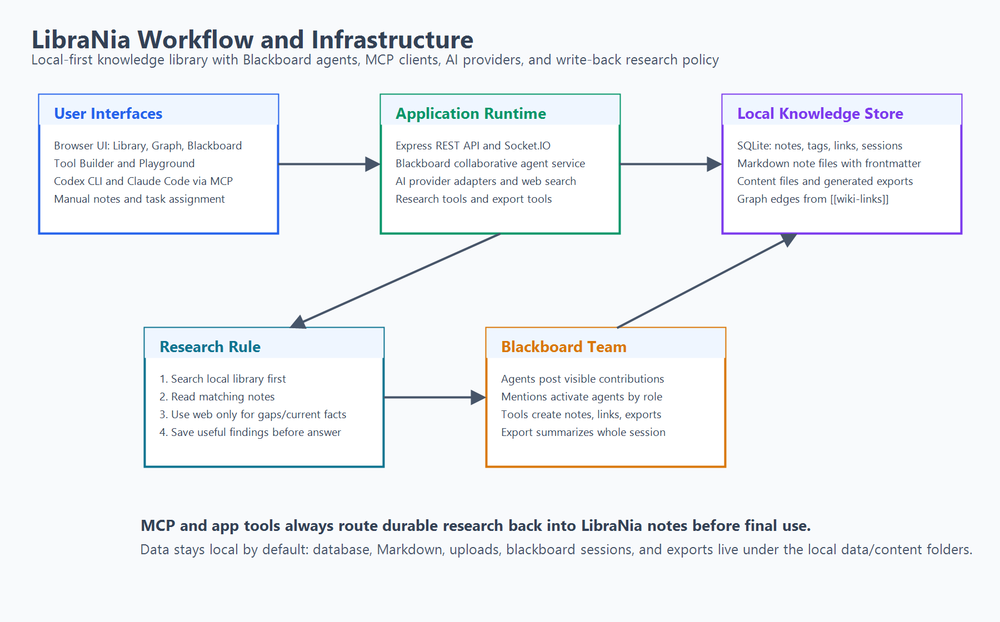

# LibraNia Workflow and Infrastructure



## System Shape

LibraNia is a local-first application with three connected entry points:

1. Browser UI for direct note, graph, Blackboard, and tool work.
2. MCP clients such as Codex and Claude Code for external agent access.
3. Backend agent services for Blackboard collaboration and research write-back.

The local library is the center of the system. Notes, tags, links, sessions, uploaded files, and exports live on disk or in SQLite.

## Infrastructure Layers

### User Interfaces

- Browser UI
- Codex CLI
- Claude Code CLI
- Claude Desktop or other MCP clients

These clients either call the backend API or launch the MCP stdio server.

### Application Runtime

- Express REST API
- Socket.IO streaming
- Blackboard service
- AI provider adapters
- Research tools
- Export tools
- Content import and remote image handling

The runtime coordinates user actions, agent turns, tool calls, and library writes.

### Knowledge Store

- SQLite database: notes, tags, links, content metadata, Blackboard sessions
- Markdown files: portable note copies
- Content directory: uploads and imported images
- Export directory: generated Blackboard reports

## Research Workflow

The intended research workflow is strict:

1. Receive research task.
2. Search LibraNia with `search_notes`.
3. Read matching notes with `get_note`.
4. Decide whether existing notes are enough.
5. If not enough, use web search or AI provider research.
6. Save useful durable findings with `create_note` or `update_note`.
7. Add tags with `add_tags`.
8. Link related notes using `[[Exact Note Title]]`.
9. Answer the user using saved library knowledge and cited sources.

This prevents knowledge from being trapped in chat transcripts.

## Blackboard Workflow

1. User opens a Blackboard session.
2. User assigns a task.
3. Blackboard builds a compact shared observation.
4. Active agents respond according to their role.
5. Agents can call tools.
6. Agents can mention inactive agents to bring them into the session.
7. The session records visible messages and detailed debug information.
8. Export Agent summarizes the complete session when requested.

Blackboard is intended to feel like a team room, not a linear hidden chain.

## MCP Workflow

1. Codex or Claude starts.
2. The client loads project instructions from `AGENTS.md` or `CLAUDE.md`.
3. The client connects to `librania` MCP.
4. Research starts with local library search.
5. If web research is needed, durable findings are written back through MCP tools.
6. The final answer names the notes used, created, or updated.

## Data Flow

```text
User task
  -> UI or MCP client
  -> Blackboard/API/MCP tool
  -> search local SQLite notes
  -> optional AI provider or web search
  -> create/update Markdown note and SQLite row
  -> update tags and links
  -> graph and future agents can reuse the knowledge
```

## Export Flow

```text
Blackboard session
  -> Export Agent
  -> summarize all useful session content
  -> include user clarifications as questionnaire/extra context
  -> write library note, Markdown file, or both
```

## Operational Notes

- `data/` and `content/` are personal runtime folders and should stay out of git.
- MCP uses stdio, so there is no separate MCP HTTP port.
- The backend web server serves the browser app and API.
- External AI providers are optional, but required for model-backed agent responses.
- Build verification is `npm run build:package` plus `cd mcp-server && npm run build`.
